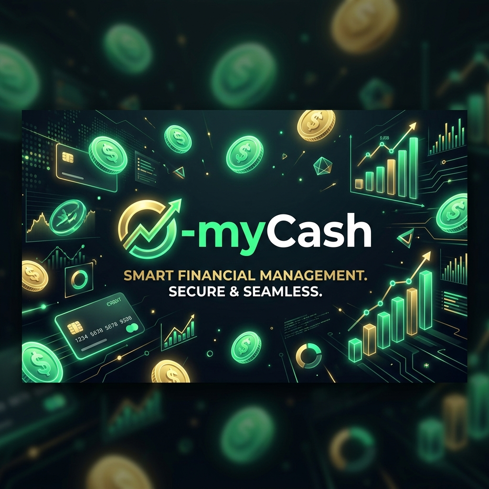

# 💰 O-myCash - Gestión Financiera con IA & Seguridad Avanzada

**O-myCash** es una solución financiera de élite diseñada para quienes no comprometen ni su seguridad ni su tiempo. Combinando la **Regla 50/30/20** con **Inteligencia Artificial** y **Seguridad de Grado Militar**, esta app redefine el control de tus finanzas personales.

---

## 🚀 Innovaciones Tecnológicas

### 👁️ Escaneo de Recibos con IA (OCR)
Olvida el registro manual. Con el motor de **Google ML Kit**, puedes tomar una foto a cualquier ticket de compra y O-myCash extraerá automáticamente:
*   El monto total de la compra.
*   Una sugerencia de categoría basada en el comercio.

### 🧠 Inteligencia de Ahorro y Predicciones
*   **Predictor de Metas**: Nuestro algoritmo analiza tu ritmo de ahorro real para darte una fecha estimada de cumplimiento de tus sueños.
*   **Smart Coaching**: Recibe consejos financieros contextuales (Smart Tips) basados en si estás respetando tus límites de gastos fijos y deseos.

### 🔒 Seguridad de Grado Militar
Tus datos son solo tuyos. Hemos implementado capas de seguridad robustas:
*   **Encriptación SQLCipher**: La base de datos local está cifrada con AES-256. Nadie puede leer tu información sin la llave única de tu dispositivo.
*   **Acceso Biométrico**: Protege la entrada a la app con tu huella dactilar o reconocimiento facial (FaceID/Biometría).

### ☁️ Sincronización Privada en la Nube
*   **Google Drive Sync**: Respalda y restaura tus datos utilizando tu propia cuenta de Google.
*   **Carpeta Privada (App Data)**: Los respaldos se guardan en una zona oculta y segura de tu Drive, inaccesible para otras aplicaciones.

---

## 🌟 Características Clásicas Mejoradas
*   **Distribución 50/30/20 Personalizable**: Ajusta los porcentajes de necesidades, deseos y ahorro según tu estilo de vida.
*   **Dashboard Dinámico**: Visualización interactiva de tu balance y salud financiera.
*   **Reportes PDF**: Genera resúmenes profesionales de tus movimientos.
*   **Offline First**: Funciona perfectamente sin internet, priorizando tu privacidad.

---

## 📸 Interfaz de Usuario Premium

<table style="width: 100%; border: none;">
  <tr>
    <td align="center" width="33%"> <b>Dashboard con Smart Tips</b></td>
    <td align="center" width="33%"> <b>Control Encriptado</b></td>
    <td align="center" width="33%"> <b>OCR Ready</b></td>
  </tr>
</table>

---

## 🛠️ Stack Tecnológico de Vanguardia

*   **IA & Vision**: [Google ML Kit](https://developers.google.com/ml-kit) (Reconocimiento de Texto).
*   **Seguridad**: [SQLCipher](https://www.zetetic.net/sqlcipher/) & [Local Auth](https://pub.dev/packages/local_auth).
*   **Almacenamiento Seguro**: [Flutter Secure Storage](https://pub.dev/packages/flutter_secure_storage).
*   **Cloud**: [Google Drive API](https://developers.google.com/drive).
*   **Framework**: Flutter (UI Premium & Multiplataforma).
*   **Visualización**: FL Chart & Lucide Icons.

---

## 👨‍💻 Desarrollador

**ChrizDev** - *Ingeniería de Software con Propósito y Elegancia*

---
*O-myCash no es solo una app, es tu nuevo cerebro financiero inteligente.*
